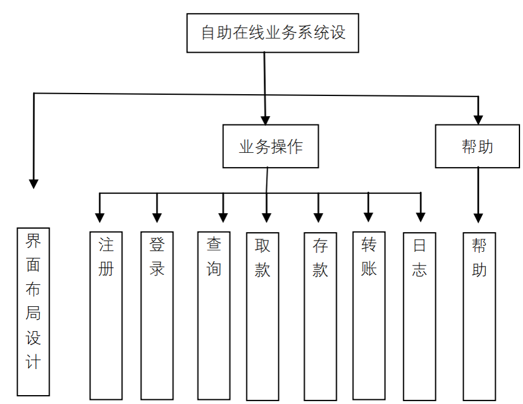
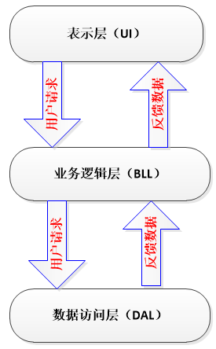
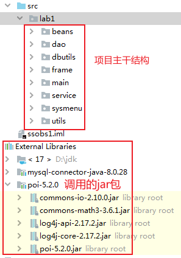
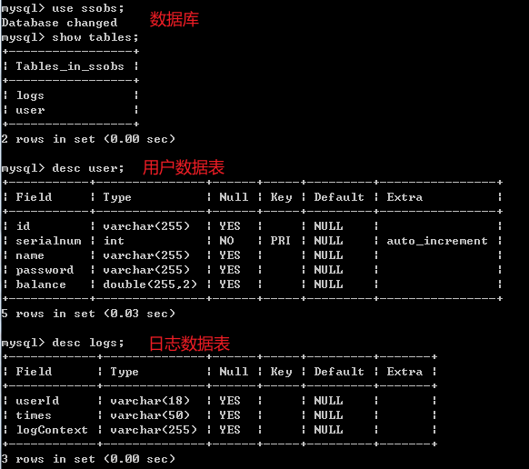

# 银行自助在线业务系统总结报告

## **一、开发环境与工具**

开发语言：Java

JDK版本: jdk.17.0.2

IDE: Intellij IDEA

数据库：MySQL8

日志组件：log4j2

## **二、项目介绍**

### 1.自助在线业务系统的主要功能如下:

​	需求分析

 （1） 用户管理，包括用户的登录和注册功能。
 （2） 账户余额查询功能。
 （3） 账户存取款功能。
 （4） 转账功能。
 （5） 交易日志功能。



### 2.项目结构

按照三层架构结构编写

将业务应用划分为**表示层 UI**、**数据访问层 DAL** 以及**业务逻辑层 BLL**。



---

### 3.自助在线业务系统代码结构



---

### 4.数据库结构



---

### **数据访问层 DAL** 

​	**beans包**：创建数据实体类， 实体类与数据表设计相对应

​	**dao包**：数据访问对象（DAO） 用来进行数据库驱动、 连接、 关闭等操作， 其中包括不同数据表					的操作方法。

​	**dbutils包**：数据库连接辅助类

### **业务逻辑层 BLL**

​	**service包**：实现功能如登录、注册等

​	**utils包**：功能辅助类，**代码重构**提高代码复用性，健壮性。

### **表示层 UI**

​	**main包**：程序的入口

​	**frame包**：系统的GUI界面

​	**systmenu包**：控制台交互菜单

---

## 主要功能实现

#### **数据访问层 DAL** 

**dao包**

UserDaoImpl类实现DAO接口，可以实现对数据库的增删改查，属于数据访问层

findUserbyId()方法实现根据用户ID查找User对象以便对账户操作

 createNewUser()和addUser(String id, int serialNum)方法实现用户的注册

```java
public class UserDaoImpl implements UserDao {
/**
 * 根据id查找数据库中的账号
 * @param id
 * @return 返回对应id账号的User对象，如果不存在返回null
 * */
    @Override
    public User findUserbyId(String id) {
        if(id == null){
            return null;
        }
        Connection conn = DBHelper.getConn();
        String sql = "select * from User WHERE id='" + id + "';";
        PreparedStatement stat = null;
        ResultSet rs = null;
        User u = new User();
        try {
            stat = conn.prepareStatement(sql);
            rs = stat.executeQuery();
            while (rs.next()) {
                u.setId(rs.getString("id"));
                u.setName(rs.getString("name"));
                u.setPassword(rs.getString("password"));
                u.setBalance(rs.getDouble("balance"));
            }
        } catch (SQLException e) {
            e.printStackTrace();
        } finally {
            DBHelper.closeAll(conn,stat,rs);
        }
        if (u.getId().equals(" "))
            return null;
        else
            return u;
    }
//插入空账号，用于注册
    @Override
    public void createNewUser() {
        Connection conn = DBHelper.getConn();
        String sql = "INSERT User (id,name,password,balance) VALUES(null,null,null,null); ";
        PreparedStatement stat = null;
        ResultSet rs = null;
        try {
            stat = conn.prepareStatement(sql);
            stat.executeUpdate();
        } catch (SQLException e) {
            e.printStackTrace();
        } finally {
            DBHelper.closeAll(conn,stat,rs);
        }
    }
    /*
    * 设置空账号，用于注册，正式添加用户
    * @param id         根据序列号生成的ID账号
    * @param serialNm
    * */
    @Override
    public void addUser(String id, int serialNum) {
        Connection conn = DBHelper.getConn();
        String sql = "UPDATE User SET id='" + id + "' WHERE serialnum ='" + serialNum + "';";
        PreparedStatement stat = null;
        ResultSet rs = null;
        try {
            stat = conn.prepareStatement(sql);
            stat.executeUpdate();
        } catch (SQLException e) {
            e.printStackTrace();
        } finally {
            DBHelper.closeAll(conn,stat,rs);
        }
    }
    /*
    * 更新指定user的所有数据
    * @param user 已设定号数据的user对象
    * */
    @Override
    public void updataUser(User user) {
        Connection conn = DBHelper.getConn();
        String sql = "UPDATE User SET name='" + user.getName() +
                "',password='" + user.getPassword() + "',balance=" +
                user.getBalance() + "WHERE id ='" + user.getId() + "';";
        PreparedStatement stat = null;
        ResultSet rs = null;
        try {
            stat = conn.prepareStatement(sql);
            stat.executeUpdate();
        } catch (SQLException e) {
            e.printStackTrace();
        } finally {
            DBHelper.closeAll(conn,stat,rs);
        }
    }
    /*
    * 获取空账号的ID序列，用于注册，定位空账号
    * @return 空账号的ID序列号
    * */
    @Override
    public int getSerial() {
        int serialNum = 0;
        Connection conn = DBHelper.getConn();
        String sql = "select * from User where id is null ;";
        PreparedStatement stat = null;
        ResultSet rs = null;
        try {
            stat = conn.prepareStatement(sql);
            rs = stat.executeQuery();
            while (rs.next()) {
                serialNum = rs.getInt("serialnum");
            }
        } catch (SQLException e) {
            e.printStackTrace();
        } finally {
            DBHelper.closeAll(conn,stat,rs);
        }
        return serialNum;
    }
}
```

**dbutils包**

DBHelper类实现与数据库的连接，独立一个类便于代码的复用

closeAll()方法关闭数据库连接，防止连接未释放，造成内存泄漏

```java
public class DBHelper {//连接数据库
    public static  Connection conn=null;
    public static final String DRIVER="com.mysql.cj.jdbc.Driver";
    public static final String RUL="jdbc:mysql://localhost:3306/ssobs?serverTimezone=Asia/Shanghai&useSSL=true";
    public static final String DBUser="root";
    public static final String DBPassword="123456";

    public static Connection getConn() {
        try{
            Class.forName(DRIVER);
            conn= DriverManager.getConnection(RUL,DBUser,DBPassword);
        }catch (SQLException | ClassNotFoundException e) {
            e.printStackTrace();
        }
        return conn;
    }
    //关闭数据库连接
    public static void closeAll(Connection conn, PreparedStatement pstmt, ResultSet rs) {
        if(rs != null) {
            try {
                rs.close();
            }catch (Exception e) {
                e.printStackTrace();
            }
        }
        if(pstmt != null){
            try{
                pstmt.close();
            }catch(Exception e) {
                e.printStackTrace();
            }
        }
        if (conn != null) {
            try {
                conn.close();
            }catch (Exception e) {
                e.printStackTrace();
            }
        }
    }
}
```

---

#### **业务逻辑层 BLL**

**service包**

实现功能登录、注册、查余额、存款、取款、转账、查看日志、查看帮助

UserService类可以在控制台显示和操作所有功能

```java
public class UserService {
    //注册
    public void singIn(){
        //创建账号对象
        User user = new User();
        //在数据库中插入新空用户，自动生成ID序列号
        UserDaoImpl udi = new UserDaoImpl();
        udi.createNewUser();//创建新用户
        int serialnum = udi.getSerial();//获取序列号
        // 使用ID序列号生成ID账号
        String id = String.format("%06d",serialnum);//将结果用零来填充6位
        //创建新用户ID
        user.setId(id);
        //在数据库中添加账号的ID
        udi.addUser(id,serialnum);
        System.out.println("开始用户注册，请输入你的名字：");
        //创建名字
        String userName = getString();

        //创建密码
        String userPasswd = getPassword();

        user.setName(userName);
        user.setPassword(userPasswd);
        user.setBalance(0);
        udi.updataUser(user);//更新用户到数据库
        System.out.println("用户："+userName+"注册完成！感谢使用本次银行账户。");
    }
    //登录
    public User login(){
        System.out.println("请输入账号：");
        String id_login = ValidationUtil.getString();

        UserDaoImpl userdi = new UserDaoImpl();
        User user_login = userdi.findUserbyId(id_login);//id是否为账号？？？

        System.out.println("请输入密码：");
        String pws_login = ValidationUtil.getString();
        //判断账户是否存在、密码是否匹配
        if (user_login != null && user_login.getPassword().equals(pws_login)){
            System.out.println("登录成功！当前账号为："+id_login);
            //记录登录日志
            LogService.addLogs(user_login,"用户登录系统");
        } else {
            System.out.println("账号或密码错误，登录失败。");
            user_login=null;
        }
        return user_login;
    }
	//查询余额
    public void search(User user_Login){
        System.out.println("您的余额为："+user_Login.getBalance()+"元。");
        LogService.addLogs(user_Login,"用户查询余额");
    }
    //取款
    public void draw(User user_Login){
        System.out.println("请输入取款金额：");
        //输入取款金额，并做非数字的判断
        double money_draw = 0;
        money_draw = ValidationUtil.get();
        if (user_Login.getBalance() >= money_draw) {
            //取款操作
            user_Login.setBalance(user_Login.getBalance()-money_draw);
            //更新数据库
            UserDaoImpl udi = new UserDaoImpl();
            udi.updataUser(user_Login);
            System.out.println("取款成功！");
            LogService.addLogs(user_Login,"用户取款，金额："+money_draw);
        } else{
            System.out.println("取款失败！余额不足。");
            LogService.addLogs(user_Login,"用户取款失败余额不足");
        }
    }
    //存款
    public void deposit(User user_Login) {
        System.out.println("请输入存款金额：");
        //输入存款的金额，并做非数字的判断
        double money_deposit = 0;
        money_deposit = ValidationUtil.get();
        //操作存款
        user_Login.setBalance(user_Login.getBalance()+money_deposit);
        //更新数据库
        UserDaoImpl udi = new UserDaoImpl();
        udi.updataUser(user_Login);
        System.out.println("存款成功");
        LogService.addLogs(user_Login,"用户存款，金额："+money_deposit);
    }
	//日志
    public void Logout(User user_Login){
        Date time = new Date();
        SimpleDateFormat sdf = new SimpleDateFormat();
        String dateTimeNow = sdf.format(time);
        //记录登出系统时间
        System.out.println(user_Login.getId()+" 于"+dateTimeNow+" 登出系统。");
        LogService.addLogs(user_Login,"退出登录");
        //将当前登录清除
        user_Login = null;
    }
	//帮助
    public void help(User user_Login){
        System.out.println("******欢迎来到自助在线业务系统******");
        System.out.println("        \t1.关于注册");
        System.out.println("        \t2.关于登录");
        System.out.println("        \t3.关于转账");
        System.out.println("        \t 如有问题请致电139xxxxxxxxx");
        System.out.println("**********************************");
        System.out.println("请输入操作功能：");
        LogService.addLogs(user_Login,"用户查看帮助手册");
    }
	//转账
    public void transfer(User user_Login){
        System.out.println("请输入转账的账户ID：");
        String tranId = ValidationUtil.getString();
        System.out.println("请输入转账的账户的姓名：");
        String tranName = ValidationUtil.getString();
        UserDaoImpl udi = new UserDaoImpl();
        User tranUser = udi.findUserbyId(tranId);
        if(tranId.equals(tranUser.getId()) && tranName.equals(tranUser.getName())){
            System.out.println("请输入转入的金额：");
            double tranMoney = ValidationUtil.get();
            if(user_Login.getBalance()>=tranMoney){
                double totalMoney2 = tranUser.getBalance() + tranMoney;
                tranUser.setBalance(totalMoney2);
                double totalMoney1 = user_Login.getBalance() - tranMoney;
                user_Login.setBalance(totalMoney1);
                udi.updataUser(tranUser);
                udi.updataUser(user_Login);
                System.out.println("转账成功！转账金额为："+tranMoney+"元。"+"当前您的账户余额为"+user_Login.getBalance()+"元。");
                LogService.addLogs(user_Login,"转账给用户:"+tranName+",转账金额："+tranMoney);
                LogService.addLogs(tranUser,"收到用户："+user_Login.getName()+"的转账，转账金额："+tranMoney);
            } else {
                System.out.println("余额不足");
            }
        } else {
            System.out.println("用户ID与用户名不匹配，转账失败。");
            LogService.addLogs(user_Login,"转账失败");
        }
    }
}
```

OutputExcel类实现可自由选择路径导出Excel格式的日志

```java
public class OutputExcel {
    /*
     * 查询日志
     * */
    public static List<Logs> queryLogs(User user) {
        LogDaoImpl logdaoimpl = new LogDaoImpl();
        List<Logs> logList = logdaoimpl.queryLog(user.getId());
        return logList;
    }
    /*
     * 导出日志，导成Excel
     * */
    public OutputExcel(User user) throws Exception {

        //写入日志到Excel
        String[] title = {"账号", "时间", "操作系统"};
        HSSFWorkbook workbook = new HSSFWorkbook();//创建Excel工作表
        HSSFSheet sheet = workbook.createSheet();//创建一个工作表sheet
        HSSFRow row = sheet.createRow(0);//创建第一行
        HSSFCell cell;//创建单元格
        //插入第一行数据、id、name、sex
        for (int i = 0; i < title.length; i++) {
            cell = row.createCell(i);
            cell.setCellValue(title[i]);
        }
        //追加数据
        List<Logs> logList = queryLogs(user);
        Iterator<Logs> list = logList.iterator();
        int i = 1;
        while (list.hasNext()) {
            Logs log = list.next();
            HSSFRow nextRow = sheet.createRow(i);//创建第二行单元格
            HSSFCell cell2 = nextRow.createCell(0);
            cell2.setCellValue(log.getUserId());
            cell2 = nextRow.createCell(1);
            cell2.setCellValue(log.getTimes());
            cell2 = nextRow.createCell(2);
            cell2.setCellValue(log.getLogContext());
            i++;
        }
        //可选择日志文件存放的路径
        JFileChooser chooser = new JFileChooser();
        chooser.setFileSelectionMode(JFileChooser.DIRECTORIES_ONLY);//仅仅选择文件夹
        chooser.showOpenDialog(null);
        String path = chooser.getSelectedFile().getPath();
        String time = DateUtil.getDateTimeNow();
        //创建一个文件：文件路径可更新
        File file = new File(path+"/Log_"+user.getId()+"_"+time+".xls");
        FileOutputStream stream = FileUtils.openOutputStream(file);//文件流
        workbook.write(stream);//写入流
        stream.close();//关闭流
        JOptionPane.showMessageDialog(null,"日志导出成功！","日志导出",JOptionPane.INFORMATION_MESSAGE);
    }
}
```

---

#### **表示层 UI**

**frame包**存放图形界面，属于表示层 

GUI的设计思路：一个.java文件实现一个功能（如：存款、取款……）其中有两个类，一个类继承JFrame，作为图形框架。一个类实现ActionListener接口，作为事件监听类，两个类之间用一个框架类的变量产生联系，事件监听类中的actionPerformed()方法就可以以`类名.属性/方法 如：Class.forName()`的形式实现面向对象编程。目的是将图形框架和事件监听独立开以避免代码混乱，增加代码可读性。下面以取款WithdrawFrame.java文件为例。

```java
//WithdrawFrame是框架类
public class WithdrawFrame extends JFrame {
    User user1;
    UserDaoImpl udi;
    JPanel panel1;
    JPanel panel2;
    JPanel panel3;
    JLabel title;
    JTextField withdrawmoney;
    JButton button;
    public WithdrawFrame(User user){
        //图形界面的设计
        panel1 = new JPanel();
        panel2 = new JPanel();
        panel3 = new JPanel();
        button = new JButton("确定");
        Font font = new Font("宋体",Font.PLAIN,20);
        title = new JLabel("请输入您的取款金额");
        title.setFont(font);
        withdrawmoney = new JTextField(15);
        panel1.add(title);
        panel2.add(withdrawmoney);
        panel3.add(button);
        add(panel1);
        add(panel2);
        add(panel3);
        setTitle("取款");
        setBounds(300,200,300,200);
        setLayout(new GridLayout(3,1));
        setVisible(true);
        setDefaultCloseOperation(JFrame.DISPOSE_ON_CLOSE);
        //注册事件
        button.addActionListener(new WithdrawAction(this));
        user1 = user;
        udi = new UserDaoImpl();
    }
}
//WithdrawAction是事件监听类
class WithdrawAction implements ActionListener{
    //定义WithdrawFrame框架类的私有属性，以便联系GUI框架类和事件监听类
    private WithdrawFrame frame;
    //定义构造方法，用于传参
    public WithdrawAction(WithdrawFrame frame){
        this.frame = frame;
    }
    @Override
    public void actionPerformed(ActionEvent e) {
        if(e.getSource()==frame.button){
            String str = frame.withdrawmoney.getText();
            if(str.equals("")){
                JOptionPane.showMessageDialog(null,"请输入要取款的余额。");
            }else{
                //调用GuiUtil辅助类判断用户输入取款金额是否为数字
                GuiUtil.digit(str);
                if(!GuiUtil.k){
                    double numb = Double.parseDouble(str);
                    frame.user1.setBalance(frame.user1.getBalance()-numb);
                    frame.udi.updataUser(frame.user1);
                    TradeMenuFrame.jTextArea.append("\n您成功取款："+numb+"元。");
                    frame.dispose();
                    JOptionPane.showMessageDialog(null,"您成功取款"+numb+"元。");
                }
                GuiUtil.k = false;
            }
        }
    }
}
```

LogFrame类查询日志在JTable中显示

```java
public class LogFrame extends JFrame {
	//定义行和列的两个动态数组
    Vector rowData,columnNames;
    JTable jt;
    JScrollPane jsp;
	//与数据库建立联系
    Connection conn = null;
    PreparedStatement ps = null;
    ResultSet rs = null;
	//定义构造方法
    public LogFrame(User user) {
        //存放列名
        columnNames = new Vector();
        columnNames.add("userId");
        columnNames.add("times");
        columnNames.add("logContext");
        //rowData用来存放行数据
        rowData = new Vector();
        //表格添加内容
        try {
            conn = DBHelper.getConn();
            ps = conn.prepareStatement("SELECT * FROM logs WHERE userId='" + user.getId() + "';");
            rs = ps.executeQuery();
			//将数据库查出的数据填入动态数组
            while (rs.next()) {
                Vector hang = new Vector();
                hang.add(rs.getString("userId"));
                hang.add(rs.getString("times"));
                hang.add(rs.getString("logContext"));
                //加入到rowData
                rowData.add(hang);
            }
        } catch (SQLException e) {
            JOptionPane.showMessageDialog(null, "用户网格视图中有错误。 " + e);
        }finally{
            DBHelper.closeAll(conn,ps,rs);
        }
		//将数据加入到JTable中
        jt = new JTable(rowData,columnNames);
        jsp = new JScrollPane(jt);//设置滚动条
        add(jsp);

        setTitle("日志");
        pack();//窗口自适应
        setVisible(true);
        setBounds(300, 200, 600, 300);
        setDefaultCloseOperation(JFrame.DISPOSE_ON_CLOSE);
    }
}
```

---

最后以Main包中的main()方法作为程序的入口


---

## **三、运行结果**


---

## **四、总结**

**不足之处**

本系统实现了银行系统应有的基本功能，对java项目开发了解的不够多，时间和能力有限，还有一部

分功能未能实现。银行系统的场景设计和布局还比较简单，有些模块和功能的设计不是那么的完善，代

码健壮性不够，有许多安全性问题未考虑周到如SQL注入等问题还未得到解决。

**收获颇丰**

通过这次项目设计以及撰写本项目报告，我学会了许多编程的技巧，尤其是对代码复用有了基本的了解

，而且对Debug调试的错误有进一步的认识，大大提高了我的编程效率。 有时候就一个小小的语法错误

就会导致程序调试不通过。所以每个字符，每句程序都要认真对待。同时和搭档的愉快合作让我少走了

许多弯路，学会了如何去分工合作，交流意见和技能互补的团队合作意识。

 